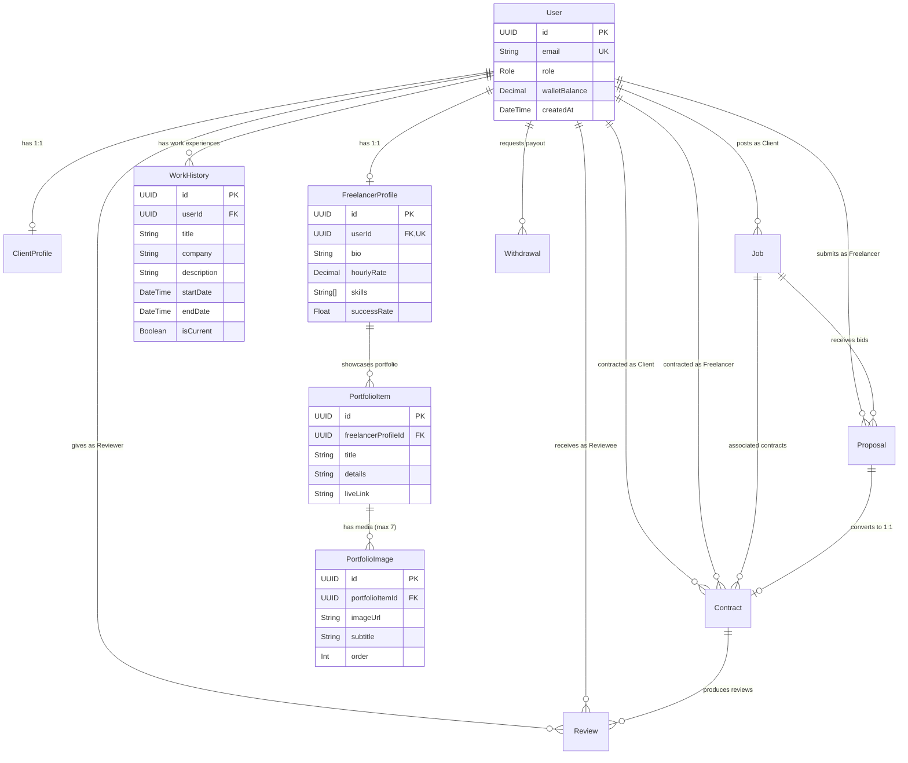

# Phase 1: Database Design & Architecture

## 1. Purpose
The purpose of Phase 1 is to construct a scalable, high-integrity relational database schema for the Freelance Marketplace application using **PostgreSQL** and **Prisma ORM 7**. A robust database model ensures strict data consistency, efficient indexing for search & query performance, and financial data integrity for client-freelancer transactions, escrow, double-blind reviews, portfolios, and local payout processing.

---

## 2. What To Do
- [x] Select and set up database technology stack (PostgreSQL + Prisma 7 ORM).
- [x] Configure Prisma 7 configuration file ([`prisma.config.ts`](file:///e:/Web%20Dev/startup/marketplace/backend/prisma.config.ts)) using `@prisma/config` with `env('DATABASE_URL')`.
- [x] Define relational data models in `schema.prisma`:
  - `User`: Core authentication entity with role (`CLIENT`, `FREELANCER`, `ADMIN`) and `walletBalance`.
  - `ClientProfile` & `FreelancerProfile`: `1:1` polymorphic profiles linked to `User`.
  - `WorkHistory`: Work experience history for both Clients and Freelancers (`title`, `company`, `startDate`, `endDate`, `description`).
  - `PortfolioItem`: Freelancer portfolio project entries (`title`, `details`, `liveLink`).
  - `PortfolioImage`: Portfolio project media (up to 7 images per item with image URL and subtitle).
  - `Job`: Posted requirements, skills, budget, and job status.
  - `Proposal`: Freelancer bids on jobs with cover letters and bid amounts.
  - `Contract`: Escrow agreement linking client, freelancer, job, and proposal.
  - `Review`: Double-blind review and rating system post-contract completion.
  - `Withdrawal`: Local payment payout requests (bKash & Nagad).
- [x] Set up strict database integrity constraints (Unique keys on dual profiles, job proposals, double reviews, and payment IDs).
- [x] Add high-performance indexes on frequent query paths.
- [x] Execute DDL database push to synchronize schema with local PostgreSQL instance (`marketplace_db`).
- [x] Generate type-safe Prisma Client (`v7.10.0`).

---

## 3. How To Do It (Implementation Details)

### A. Environment & Prisma 7 Configuration
- Managed connection strings inside `.env` via `DATABASE_URL`.
- Initialized `prisma.config.ts` using `@prisma/config`'s `defineConfig` helper:
```ts
import 'dotenv/config';
import { defineConfig, env } from '@prisma/config';

export default defineConfig({
  schema: './prisma/schema.prisma',
  datasource: {
    url: env('DATABASE_URL'),
  },
});
```

### B. Visual Entity-Relationship (ER) Diagram


---

## 4. Status & What Is Done
- [x] **Database Engine & ORM**: PostgreSQL installed, Prisma 7 (`7.10.0`) configured.
- [x] **Schema Expansion**: Added `WorkHistory`, `PortfolioItem`, and `PortfolioImage` models to `schema.prisma`.
- [x] **Prisma Client**: Generated successfully to `node_modules/@prisma/client`.
- [x] **Database Sync**: Executed `npx prisma db push` — `marketplace_db` fully in sync.
- [x] **Build Verification**: `npx tsc --noEmit` verified with 0 errors.
