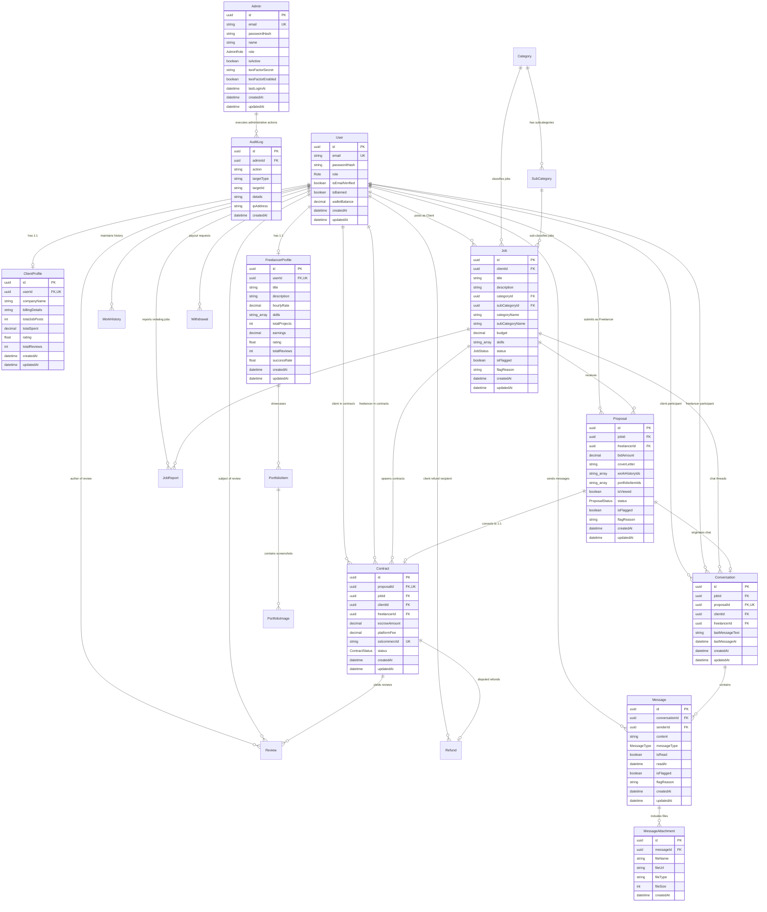

# Relational Database Schema & Architecture Documentation

This document contains the Entity-Relationship (ER) Diagram, relational database architecture, and schema documentation for the Freelance Marketplace backend powered by **PostgreSQL** and **Prisma ORM**.

---

## 1. Visual Entity-Relationship (ER) Diagram

---

## 2. Relational Schema Specification

### 2.1 Enums

| Enum Name | Allowed Values | Usage |
| :--- | :--- | :--- |
| `Role` | `CLIENT`, `FREELANCER`, `ADMIN` (deprecated) | Marketplace user actor types |
| `AdminRole` | `SUPER_ADMIN`, `ADMIN`, `MODERATOR`, `SUPPORT` | Internal back-office staff permission levels |
| `JobStatus` | `OPEN`, `IN_PROGRESS`, `COMPLETED`, `CANCELED` | Lifecycle state of posted jobs |
| `ProposalStatus` | `PENDING`, `ACCEPTED`, `REJECTED` | Freelancer proposal status |
| `ContractStatus` | `FUNDED`, `PENDING_APPROVAL`, `COMPLETED`, `DISPUTED`, `REFUNDED` | Escrow contract progression |
| `ReviewStatus` | `HIDDEN`, `PUBLISHED` | Blind review submission system |
| `WithdrawalStatus`| `PENDING`, `APPROVED`, `REJECTED` | Freelancer payout requests |
| `WithdrawalMethod`| `BKASH`, `NAGAD` | Mobile Financial Service (MFS) payout channels |
| `MessageType` | `TEXT`, `FILE`, `SYSTEM` | Chat message payload types |

---

### 2.2 Core Tables & Models

#### `Admin` (Internal Back-Office Staff)
Physically isolated from customer users to guarantee front-office vs. back-office segregation.
- `id` (UUID, PK)
- `email` (VARCHAR, Unique Index)
- `passwordHash` (VARCHAR, Bcrypt hashed)
- `name` (VARCHAR)
- `role` (`AdminRole`, Default: `ADMIN`)
- `isActive` (BOOLEAN, Default: `true`)
- `twoFactorSecret` (VARCHAR, Nullable - for TOTP Google Authenticator)
- `twoFactorEnabled` (BOOLEAN, Default: `false`)
- `lastLoginAt` (TIMESTAMPTZ, Nullable)
- `createdAt` / `updatedAt` (TIMESTAMPTZ)

#### `User` (Marketplace Clients & Freelancers)
Customer identity table handling public signups, wallet balances, and profile relationships.
- `id` (UUID, PK)
- `email` (VARCHAR, Unique Index)
- `passwordHash` (VARCHAR)
- `role` (`Role`: `CLIENT` or `FREELANCER`)
- `isEmailVerified` (BOOLEAN, Default: `false`)
- `isBanned` (BOOLEAN, Default: `false`)
- `walletBalance` (DECIMAL(12, 2), Default: `0.00`)
- `createdAt` / `updatedAt` (TIMESTAMPTZ)
- *Indexes*: `[email]`, `[role]`

#### `ClientProfile` (1:1 with User)
- `id` (UUID, PK)
- `userId` (UUID, Unique, FK -> `User.id` ON DELETE CASCADE)
- `companyName` (VARCHAR, Nullable)
- `billingDetails` (TEXT, Nullable)
- `totalJobPosts` (INT, Default: 0)
- `totalSpent` (DECIMAL(12, 2), Default: 0.00)
- `rating` (FLOAT, Default: 0.0)
- `totalReviews` (INT, Default: 0)

#### `FreelancerProfile` (1:1 with User)
- `id` (UUID, PK)
- `userId` (UUID, Unique, FK -> `User.id` ON DELETE CASCADE)
- `title` (VARCHAR, Nullable)
- `description` (TEXT, Nullable)
- `hourlyRate` (DECIMAL(10, 2), Nullable)
- `skills` (VARCHAR[], Array of skill tags)
- `totalProjects` (INT, Default: 0)
- `earnings` (DECIMAL(12, 2), Default: 0.00)
- `rating` (FLOAT, Default: 0.0)
- `totalReviews` (INT, Default: 0)
- `successRate` (FLOAT, Default: 0.0)

#### `WorkHistory` & `PortfolioItem`
- `WorkHistory`: Past client engagements, employment, and external projects (`userId`, `title`, `company`, `startDate`, `endDate`, `isCurrent`).
- `PortfolioItem`: Freelancer showcased projects (`freelancerProfileId`, `title`, `details`, `liveLink`).
- `PortfolioImage`: Image attachments for portfolio items with ordering support.

#### `Category` & `SubCategory` & `Skill`
Platform taxonomy for jobs and freelancer discovery:
- `Category`: `name`, `slug` (Unique), `isActive`.
- `SubCategory`: `categoryId` (FK), `name`, `slug`, `isActive`. Unique composite on `[categoryId, slug]`.
- `Skill`: Tag taxonomy (`name`, `slug`, `category`).

#### `Job` (Client Job Posts)
- `id` (UUID, PK)
- `clientId` (UUID, FK -> `User.id` ON DELETE CASCADE)
- `title` (VARCHAR)
- `description` (TEXT)
- `categoryId` / `subCategoryId` (FKs -> `Category.id`, `SubCategory.id` ON DELETE SET NULL)
- `budget` (DECIMAL(12, 2))
- `skills` (VARCHAR[])
- `status` (`JobStatus`: `OPEN`, `IN_PROGRESS`, `COMPLETED`, `CANCELED`)
- `isFlagged` (BOOLEAN, Default: `false`)
- `flagReason` (VARCHAR, Nullable)
- *Indexes*: `[status, createdAt]`, `[clientId]`, `[categoryId, subCategoryId]`, `[isFlagged]`

#### `Proposal` (Freelancer Bids)
- `id` (UUID, PK)
- `jobId` (UUID, FK -> `Job.id` ON DELETE CASCADE)
- `freelancerId` (UUID, FK -> `User.id` ON DELETE CASCADE)
- `bidAmount` (DECIMAL(12, 2))
- `coverLetter` (TEXT)
- `workHistoryIds` / `portfolioItemIds` (VARCHAR[])
- `isViewed` (BOOLEAN, Default: `false`)
- `status` (`ProposalStatus`: `PENDING`, `ACCEPTED`, `REJECTED`)
- `isFlagged` (BOOLEAN, Default: `false` - auto-flagged by Redis background moderation queue)
- `flagReason` (VARCHAR, Nullable)
- *Unique Constraint*: `[jobId, freelancerId]` (One proposal per freelancer per job)
- *Indexes*: `[jobId, status]`, `[freelancerId]`, `[jobId, isViewed]`, `[isFlagged]`

#### `Contract` (Funded Escrow Milestone)
- `id` (UUID, PK)
- `proposalId` (UUID, Unique, FK -> `Proposal.id` ON DELETE CASCADE)
- `jobId` (UUID, FK -> `Job.id` ON DELETE CASCADE)
- `clientId` (UUID, FK -> `User.id` ON DELETE CASCADE)
- `freelancerId` (UUID, FK -> `User.id` ON DELETE CASCADE)
- `escrowAmount` (DECIMAL(12, 2))
- `platformFee` (DECIMAL(12, 2))
- `sslcommerzId` (VARCHAR, Unique, Nullable)
- `status` (`ContractStatus`: `FUNDED`, `PENDING_APPROVAL`, `COMPLETED`, `DISPUTED`, `REFUNDED`)
- *Indexes*: `[clientId]`, `[freelancerId]`, `[status]`

#### `Conversation` & `Message` & `MessageAttachment` (Real-Time Chat)
- `Conversation`: Thread between client and freelancer initiated from a proposal (`jobId`, `proposalId`, `clientId`, `freelancerId`, `lastMessageText`, `lastMessageAt`). Unique composite on `[jobId, freelancerId]`.
- `Message`: Sent messages (`conversationId`, `senderId`, `content`, `messageType`, `isRead`, `readAt`, `isFlagged`, `flagReason`).
- `MessageAttachment`: Files uploaded in chat (`messageId`, `fileName`, `fileUrl`, `fileType`, `fileSize`).

#### `Review` (Blind Feedback System)
- `id` (UUID, PK)
- `contractId` (UUID, FK -> `Contract.id` ON DELETE CASCADE)
- `reviewerId` (UUID, FK -> `User.id`)
- `revieweeId` (UUID, FK -> `User.id`)
- `rating` (INT, 1-5)
- `feedback` (TEXT)
- `counterFeedback` (TEXT, Nullable)
- `status` (`ReviewStatus`: `HIDDEN` until both submit, then `PUBLISHED`)
- *Unique Constraint*: `[contractId, reviewerId]`

#### `Withdrawal` & `Refund`
- `Withdrawal`: Payout requests via bKash/Nagad (`freelancerId`, `amount`, `method`, `accountNumber`, `status`).
- `Refund`: Admin-processed escrow refunds (`contractId`, `clientId`, `amount`, `reason`, `adminId`).

#### `AuditLog` (Administrative Trail)
- `id` (UUID, PK)
- `adminId` (UUID, FK -> `Admin.id` ON DELETE CASCADE)
- `action` (VARCHAR, e.g. `USER_BANNED`, `DISPUTE_RESOLVED`, `WITHDRAWAL_APPROVED`)
- `targetType` (VARCHAR, e.g. `USER`, `JOB`, `CONTRACT`, `WITHDRAWAL`)
- `targetId` (VARCHAR, Nullable)
- `details` (TEXT, Nullable)
- `ipAddress` (VARCHAR, Nullable)
- `createdAt` (TIMESTAMPTZ, Default: `now()`)
- *Indexes*: `[adminId]`, `[action]`, `[targetType]`, `[createdAt]`

#### `PlatformSetting`
- Global platform configuration (e.g. `platformFeePercentage` defaulting to 10.0%).
