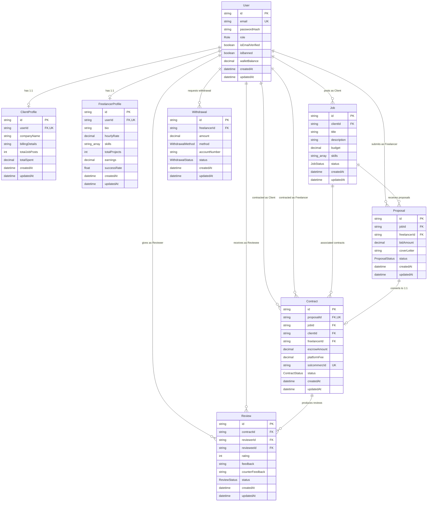

# SQL Database Schema & ER Diagram

This document contains the Entity-Relationship (ER) Diagram and relational SQL schema documentation for the Freelance Marketplace application based on PostgreSQL and Prisma ORM.

---

## 1. Visual Entity-Relationship (ER) Diagram



---

## 2. PostgreSQL DDL SQL Reference

Below is the equivalent DDL SQL script representing the relational database tables, data types, indexes, and constraints.

```sql
-- ENUMS
CREATE TYPE "Role" AS ENUM ('CLIENT', 'FREELANCER', 'ADMIN');
CREATE TYPE "JobStatus" AS ENUM ('OPEN', 'IN_PROGRESS', 'COMPLETED', 'CANCELED');
CREATE TYPE "ProposalStatus" AS ENUM ('PENDING', 'ACCEPTED', 'REJECTED');
CREATE TYPE "ContractStatus" AS ENUM ('FUNDED', 'PENDING_APPROVAL', 'COMPLETED', 'DISPUTED');
CREATE TYPE "ReviewStatus" AS ENUM ('HIDDEN', 'PUBLISHED');
CREATE TYPE "WithdrawalStatus" AS ENUM ('PENDING', 'APPROVED', 'REJECTED');
CREATE TYPE "WithdrawalMethod" AS ENUM ('BKASH', 'NAGAD');

-- 1. Users Table
CREATE TABLE "User" (
    "id" UUID PRIMARY KEY DEFAULT gen_random_uuid(),
    "email" VARCHAR(255) UNIQUE NOT NULL,
    "passwordHash" TEXT NOT NULL,
    "role" "Role" NOT NULL,
    "isEmailVerified" BOOLEAN NOT NULL DEFAULT FALSE,
    "isBanned" BOOLEAN NOT NULL DEFAULT FALSE,
    "walletBalance" NUMERIC(12, 2) NOT NULL DEFAULT 0.00,
    "createdAt" TIMESTAMP(3) NOT NULL DEFAULT CURRENT_TIMESTAMP,
    "updatedAt" TIMESTAMP(3) NOT NULL
);
CREATE INDEX "User_email_idx" ON "User"("email");
CREATE INDEX "User_role_idx" ON "User"("role");

-- 2. Client Profiles Table (1:1 with User)
CREATE TABLE "ClientProfile" (
    "id" UUID PRIMARY KEY DEFAULT gen_random_uuid(),
    "userId" UUID UNIQUE NOT NULL REFERENCES "User"("id") ON DELETE CASCADE,
    "companyName" TEXT,
    "billingDetails" TEXT,
    "totalJobPosts" INT NOT NULL DEFAULT 0,
    "totalSpent" NUMERIC(12, 2) NOT NULL DEFAULT 0.00,
    "createdAt" TIMESTAMP(3) NOT NULL DEFAULT CURRENT_TIMESTAMP,
    "updatedAt" TIMESTAMP(3) NOT NULL
);

-- 3. Freelancer Profiles Table (1:1 with User)
CREATE TABLE "FreelancerProfile" (
    "id" UUID PRIMARY KEY DEFAULT gen_random_uuid(),
    "userId" UUID UNIQUE NOT NULL REFERENCES "User"("id") ON DELETE CASCADE,
    "bio" TEXT,
    "hourlyRate" NUMERIC(10, 2),
    "skills" TEXT[] NOT NULL DEFAULT '{}',
    "totalProjects" INT NOT NULL DEFAULT 0,
    "earnings" NUMERIC(12, 2) NOT NULL DEFAULT 0.00,
    "successRate" DOUBLE PRECISION NOT NULL DEFAULT 0.0,
    "createdAt" TIMESTAMP(3) NOT NULL DEFAULT CURRENT_TIMESTAMP,
    "updatedAt" TIMESTAMP(3) NOT NULL
);

-- 4. Jobs Table
CREATE TABLE "Job" (
    "id" UUID PRIMARY KEY DEFAULT gen_random_uuid(),
    "clientId" UUID NOT NULL REFERENCES "User"("id") ON DELETE CASCADE,
    "title" TEXT NOT NULL,
    "description" TEXT NOT NULL,
    "budget" NUMERIC(12, 2) NOT NULL,
    "skills" TEXT[] NOT NULL DEFAULT '{}',
    "status" "JobStatus" NOT NULL DEFAULT 'OPEN',
    "createdAt" TIMESTAMP(3) NOT NULL DEFAULT CURRENT_TIMESTAMP,
    "updatedAt" TIMESTAMP(3) NOT NULL
);
CREATE INDEX "Job_status_createdAt_idx" ON "Job"("status", "createdAt");
CREATE INDEX "Job_clientId_idx" ON "Job"("clientId");

-- 5. Proposals Table
CREATE TABLE "Proposal" (
    "id" UUID PRIMARY KEY DEFAULT gen_random_uuid(),
    "jobId" UUID NOT NULL REFERENCES "Job"("id") ON DELETE CASCADE,
    "freelancerId" UUID NOT NULL REFERENCES "User"("id") ON DELETE CASCADE,
    "bidAmount" NUMERIC(12, 2) NOT NULL,
    "coverLetter" TEXT NOT NULL,
    "status" "ProposalStatus" NOT NULL DEFAULT 'PENDING',
    "createdAt" TIMESTAMP(3) NOT NULL DEFAULT CURRENT_TIMESTAMP,
    "updatedAt" TIMESTAMP(3) NOT NULL,
    CONSTRAINT "Proposal_jobId_freelancerId_key" UNIQUE ("jobId", "freelancerId")
);
CREATE INDEX "Proposal_jobId_status_idx" ON "Proposal"("jobId", "status");
CREATE INDEX "Proposal_freelancerId_idx" ON "Proposal"("freelancerId");

-- 6. Contracts Table
CREATE TABLE "Contract" (
    "id" UUID PRIMARY KEY DEFAULT gen_random_uuid(),
    "proposalId" UUID UNIQUE NOT NULL REFERENCES "Proposal"("id") ON DELETE CASCADE,
    "jobId" UUID NOT NULL REFERENCES "Job"("id") ON DELETE CASCADE,
    "clientId" UUID NOT NULL REFERENCES "User"("id") ON DELETE CASCADE,
    "freelancerId" UUID NOT NULL REFERENCES "User"("id") ON DELETE CASCADE,
    "escrowAmount" NUMERIC(12, 2) NOT NULL,
    "platformFee" NUMERIC(12, 2) NOT NULL,
    "sslcommerzId" VARCHAR(255) UNIQUE,
    "status" "ContractStatus" NOT NULL DEFAULT 'FUNDED',
    "createdAt" TIMESTAMP(3) NOT NULL DEFAULT CURRENT_TIMESTAMP,
    "updatedAt" TIMESTAMP(3) NOT NULL
);
CREATE INDEX "Contract_clientId_idx" ON "Contract"("clientId");
CREATE INDEX "Contract_freelancerId_idx" ON "Contract"("freelancerId");
CREATE INDEX "Contract_status_idx" ON "Contract"("status");

-- 7. Reviews Table
CREATE TABLE "Review" (
    "id" UUID PRIMARY KEY DEFAULT gen_random_uuid(),
    "contractId" UUID NOT NULL REFERENCES "Contract"("id") ON DELETE CASCADE,
    "reviewerId" UUID NOT NULL REFERENCES "User"("id"),
    "revieweeId" UUID NOT NULL REFERENCES "User"("id"),
    "rating" INT NOT NULL,
    "feedback" TEXT NOT NULL,
    "counterFeedback" TEXT,
    "status" "ReviewStatus" NOT NULL DEFAULT 'HIDDEN',
    "createdAt" TIMESTAMP(3) NOT NULL DEFAULT CURRENT_TIMESTAMP,
    "updatedAt" TIMESTAMP(3) NOT NULL,
    CONSTRAINT "Review_contractId_reviewerId_key" UNIQUE ("contractId", "reviewerId")
);
CREATE INDEX "Review_contractId_idx" ON "Review"("contractId");
CREATE INDEX "Review_revieweeId_status_idx" ON "Review"("revieweeId", "status");

-- 8. Withdrawals Table
CREATE TABLE "Withdrawal" (
    "id" UUID PRIMARY KEY DEFAULT gen_random_uuid(),
    "freelancerId" UUID NOT NULL REFERENCES "User"("id") ON DELETE CASCADE,
    "amount" NUMERIC(12, 2) NOT NULL,
    "method" "WithdrawalMethod" NOT NULL,
    "accountNumber" VARCHAR(255) NOT NULL,
    "status" "WithdrawalStatus" NOT NULL DEFAULT 'PENDING',
    "createdAt" TIMESTAMP(3) NOT NULL DEFAULT CURRENT_TIMESTAMP,
    "updatedAt" TIMESTAMP(3) NOT NULL
);
CREATE INDEX "Withdrawal_freelancerId_idx" ON "Withdrawal"("freelancerId");
CREATE INDEX "Withdrawal_status_createdAt_idx" ON "Withdrawal"("status", "createdAt");
```

---

## 3. Entity Summary & Cardinality Relationships

| Entity / Table | Description | Primary Key | Foreign Keys & Cardinality |
| :--- | :--- | :--- | :--- |
| **`User`** | System users (Clients, Freelancers, Admins) | `id` (UUID) | None |
| **`ClientProfile`** | Client profile metadata & spending | `id` (UUID) | 1:1 with `User` (`userId` UNIQUE FK) |
| **`FreelancerProfile`** | Freelancer bio, rates, skills & earnings | `id` (UUID) | 1:1 with `User` (`userId` UNIQUE FK) |
| **`Job`** | Posted project requirements & budget | `id` (UUID) | 1:N with `User` (`clientId` FK) |
| **`Proposal`** | Freelancer bid for a job | `id` (UUID) | N:1 with `Job` (`jobId`), N:1 with `User` (`freelancerId`) |
| **`Contract`** | Active/completed contract with escrow | `id` (UUID) | 1:1 with `Proposal` (`proposalId`), N:1 with `Job`, `User` (Client & Freelancer) |
| **`Review`** | Double-blind review system | `id` (UUID) | N:1 with `Contract`, N:1 with `User` (Reviewer & Reviewee) |
| **`Withdrawal`** | Freelancer payout requests (bKash/Nagad) | `id` (UUID) | N:1 with `User` (`freelancerId`) |
